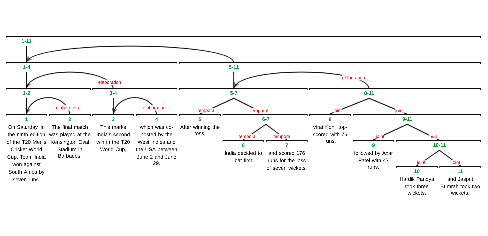

# IsaNLP RST Parser

This library provides several versions of the Rhetorical Structure Theory (RST) parser for English and Russian. Below, you will find instructions on how to set up and run the parser either locally or using Docker.

## Performance

The parser supports multiple languages and corpora. The end-to-end performance metrics for different model versions across various corpora are as follows:

### Corpora
- **English:** GUM<sub>9.1</sub>, RST-DT
- **Russian:** RRT<sub>2.1</sub>, RRG<sub>GUM-9.1</sub>

| Tag / Version | Language   | Train Data  | Test Data   | Seg  | S    | N    | R    | Full  |
|-------------|------------|-------------|-------------|------|------|------|------|-------|
| `gumrrg` | En, Ru     | GUM, RRG    | GUM         | 95.5 | 67.4 | 56.2 | 49.6 | 48.7  |
|             |            |             | RRG         | 97.0 | 67.1 | 54.6 | 46.5 | 45.4  |
| `rstdt`     | En         | RST-DT      | RST-DT      | 97.8 | 75.6 | 65.0 | 55.6 | 53.9  |
| `rstreebank` | Ru         | RRT         | RRT         | 92.1 | 66.2 | 53.1 | 46.1 | 46.2  |


## Local Setup

To use the IsaNLP RST Parser locally, follow these steps:

1. **Installation:**

   First, install the `isanlp` and `isanlp_rst` libraries using pip:

   ```bash
   pip install git+https://github.com/iinemo/isanlp.git
   pip install isanlp_rst
   ```

2. **Usage:**

    Below is an example of how to run a specific version of the parser using the library:

   ```python
   from isanlp_rst.parser import Parser

   # Define the version of the model you want to use
   version = 'gumrrg'  # Choose from {'gumrrg', 'rstdt', 'rstreebank'}
   
   # Initialize the parser with the desired version
   parser = Parser(hf_model_name='tchewik/isanlp_rst_v3', hf_model_version=version, cuda_device=0)

   # Example text for parsing
   text = """
   On Saturday, in the ninth edition of the T20 Men's Cricket World Cup, Team India won against South Africa by seven runs. 
   The final match was played at the Kensington Oval Stadium in Barbados. This marks India's second win in the T20 World Cup, 
   which was co-hosted by the West Indies and the USA between June 2 and June 29.

   After winning the toss, India decided to bat first and scored 176 runs for the loss of seven wickets. 
   Virat Kohli top-scored with 76 runs, followed by Axar Patel with 47 runs. Hardik Pandya took three wickets, 
   and Jasprit Bumrah took two wickets.
   """

   # Parse the text to obtain the RST tree
   res = parser(text)  # res['rst'] contains the binary discourse tree

   # Display the structure of the RST tree
   vars(res['rst'][0])
   ```
   
   

3. **Output Explanation:**

   The output is an RST tree with the following structure:

   ```python
   {
     'id': 7,
     'left': <isanlp.annotation_rst.DiscourseUnit at 0x7f771076add0>,
     'right': <isanlp.annotation_rst.DiscourseUnit at 0x7f7750b93d30>,
     'relation': 'elaboration',
     'nuclearity': 'NS',
     'start': 0,
     'end': 336,
     'text': "On Saturday, ... took two wickets .",
   }
   ```

   - **id**: Unique identifier for the discourse unit.
   - **left** and **right**: Children of the current discourse unit.
   - **relation**: Rhetorical relation between sub-units (e.g., "elaboration").
   - **nuclearity**: Indicates nuclearity of the relation (e.g., "NS" for nucleus-satellite).
   - **start** and **end**: Character offsets in the text for this discourse unit.
   - **text**: Text span corresponding to this discourse unit.

4. **(Optional) Save the result in RS3 format:**

   You can save the resulting RST tree in an RS3 file using the following command:

   ```python
   res['rst'][0].to_rs3('filename.rs3')
   ```

   The `filename.rs3` file can be opened in RSTTool or rstWeb for visualization or editing.

## Docker Setup

To run the IsaNLP RST Parser using Docker, follow these steps:

1. **Run the Docker container:**

   Pull and run the Docker container with the desired model version tag:

   ```bash
   docker run --rm -p 3335:3333 --name rst_rrt tchewik/isanlp_rst:3.0-rstreebank
   ```

2. **Connect using the IsaNLP Python library:**

   Install the `isanlp` library. The `isanlp_rst` library is not required for dockerized parsers:

   ```bash
   pip install git+https://github.com/iinemo/isanlp.git
   ```

   Then connect to the running Docker container:

   ```python
   from isanlp import PipelineCommon
   from isanlp.processor_remote import ProcessorRemote

   # Put the container address here
   address_rst = ('127.0.0.1', 3335)

   ppl = PipelineCommon([
       (ProcessorRemote(address_rst[0], address_rst[1], 'default'),
        ['text'],
        {'rst': 'rst'})
   ])

   res = ppl(text)
   # res['rst'] will contain the binary discourse tree, similar to the previous example
   ```

   
## Citation

If you use the IsaNLP RST Parser in your research, please cite our work as follows:

- **For versions `gumrrg`, `rstdt`, and `rstreebank`:** `TBA`