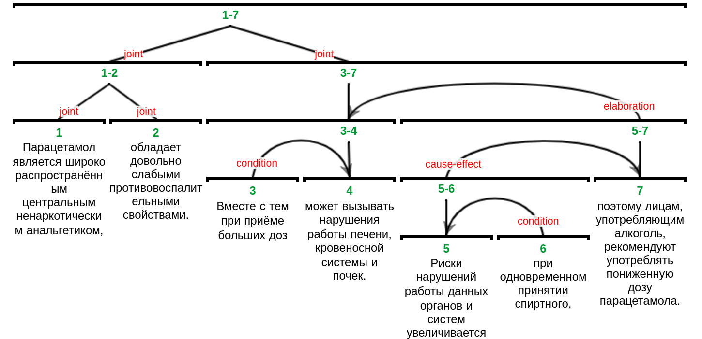

# IsaNLP RST Parser

This Python 3 library provides RST parser for Russian based on neural network models trained
on [RuRSTreebank](https://rstreebank.ru/) Russian discourse corpus. The parser should be used in conjunction
with [IsaNLP library](https://github.com/IINemo/isanlp) and can be considered its module.

## Installation

1. Install IsaNLP library:

```
pip install git+https://github.com/IINemo/isanlp.git
```  

2. Deploy docker containers for syntax and discourse parsing:

```
docker run --rm -d -p 3334:3333 --name spacy_ru tchewik/isanlp_spacy:ru
docker run --rm -d -p 3335:3333 --name rst_ru tchewik/isanlp_rst:2.1-rstreebank
```  

3. Connect from python using `PipelineCommon`:

```python
from isanlp import PipelineCommon
from isanlp.processor_remote import ProcessorRemote
from isanlp.processor_razdel import ProcessorRazdel

# put the address here ->
address_syntax = ('', 3334)
address_rst = ('', 3335)

ppl_ru = PipelineCommon([
    (ProcessorRazdel(), ['text'],
     {'tokens': 'tokens',
      'sentences': 'sentences'}),
    (ProcessorRemote(address_syntax[0], address_syntax[1], '0'),
     ['tokens', 'sentences'],
     {'lemma': 'lemma',
      'morph': 'morph',
      'syntax_dep_tree': 'syntax_dep_tree',
      'postag': 'postag'}),
    (ProcessorRemote(address_rst[0], address_rst[1], 'default'),
     ['text', 'tokens', 'sentences', 'postag', 'morph', 'lemma', 'syntax_dep_tree'],
     {'rst': 'rst'})
])

text = ("Парацетамол является широко распространённым центральным ненаркотическим анальгетиком, обладает довольно "
        "слабыми противовоспалительными свойствами. Вместе с тем при приёме больших доз может вызывать нарушения "
        "работы печени, кровеносной системы и почек. Риски нарушений работы данных органов и систем "
        "увеличивается при одновременном принятии спиртного, поэтому лицам, употребляющим алкоголь, рекомендуют "
        "употреблять пониженную дозу парацетамола.")

res = ppl_ru(text)
```   

4. The `res` variable should contain all annotations including RST annotations stored in `res['rst']`; each tree
   anotation in list represents one or more paragraphs of the given text.

```
{'text': 'Парацетамол является широко распространённым ...',
 'tokens': [<isanlp.annotation.Token at 0x7f833dee0910>, ...],
 'sentences': [<isanlp.annotation.Sentence at 0x7f833dee07d0>, ...],
 'lemma': [['парацетамол', 'являться', ...], ...],
 'morph': [[{'Animacy': 'Inan', 'Case': 'Nom', ...}, ...], ...],
 'syntax_dep_tree': [[<isanlp.annotation.WordSynt at 0x7f833deddc10>, ...], ...],
 'postag': [['NOUN', ...], ...],
 'rst': [<isanlp.annotation_rst.DiscourseUnit at 0x7f833defa5d0>]}
```

5. The variable `res['rst']` can be visualized as:  

   

6. To convert a list of DiscourseUnit objects to *.rs3 file with visualization, run:

```python
from isanlp.annotation_rst import ForestExporter

exporter = ForestExporter(encoding='utf8')
exporter(res['rst'], 'filename.rs3')
```

## Package overview

1. The discourse parser. Is implemented in `ProcessorRST` class. Path: `src/isanlp_rst/processor_rst.py`.
2. Trained neural network models for RST parser: models for segmentation, structure prediction, and label prediction.
   Path: `models`.
3. Docker container [tchewik/isanlp_rst](https://hub.docker.com/r/tchewik/isanlp_rst/) with preinstalled
   libraries and models. Use the command: `docker run --rm -p 3335:3333 tchewik/isanlp_rst`

## Usage

The usage example is available in `examples/usage.ipynb`.

### RST data structures

The results of RST parser are stored in a list of `isanlp.annotation_rst.DiscourseUnit` objects. Each object represents
a tree for a paragraph or multiple paragraphs of a text.
DiscourseUnit objects have the following members:

* id (int): id of a discourse unit.
* start (int): starting position (in characters) of a current discourse unit span in original text.
* end (int): ending position (in characters) of a current discourse unit span in original text.
* relation (string): 'elementary' if the current unit is a discourse tree leaf, or RST relation.
* nuclearity (string): nuclearity orientation for current unit. `_` for elementary discourse units or one of `NS`, `SN`
  , `NN` for non-elementary units.
* left (DiscourseUnit or None): left child node of a non-elementary unit.
* right (DiscourseUnit or None): right child node of a non-elementary unit.
* proba (float): probability of the node presence obtained from structure classifier.

It is possible to operate with DiscourseUnits objects as binary structures. For example, to extract relations pairs from
the tree like this:

```python
def extr_pairs(tree, text):
    pp = []
    if tree.left:
        pp.append([text[tree.left.start:tree.left.end],
                   text[tree.right.start:tree.right.end],
                   tree.relation, tree.nuclearity])
        pp += extr_pairs(tree.left, text)
        pp += extr_pairs(tree.right, text)
    return pp

print(extr_pairs(res['rst'][0], res['text']))
# [['Президент Филиппин заявил,', 'что поедет на дачу, если будут беспорядки.', 'attribution', 'SN'], 
# ['что поедет на дачу,', 'если будут беспорядки.', 'condition', 'NS']]
```  

# Cite

https://link.springer.com/chapter/10.1007/978-3-030-72610-2_8

* Gost:
  Chistova E., Shelmanov A., Pisarevskaya D., Kobozeva M. and Isakov V., Panchenko A., Toldova S. and Smirnov I. RST
  Discourse Parser for Russian: An Experimental Study of Deep Learning Models // Proceedings of Analysis of Images,
  Social Networks and Texts (AIST). — 2020. — P. 105-119.

* BibTeX:

```
@inproceedings{chistova2020rst,
  title={{RST} Discourse Parser for {R}ussian: An Experimental Study of Deep Learning Models},
  author={Chistova, Elena and Shelmanov, Artem and Pisarevskaya, Dina and Kobozeva, Maria and Isakov, Vadim  and Panchenko, Alexander  and Toldova, Svetlana  and Smirnov, Ivan },
  booktitle={In Proceedings of Analysis of Images, Social Networks and Texts (AIST)},
  pages={105--119},
  year={2020}
}
```

* Springer:
  Chistova E. et al. (2021) RST Discourse Parser for Russian: An Experimental Study of Deep Learning Models. In: van der
  Aalst W.M.P. et al. (eds) Analysis of Images, Social Networks and Texts. AIST 2020. Lecture Notes in Computer Science,
  vol 12602. Springer, Cham. https://doi.org/10.1007/978-3-030-72610-2_8  
