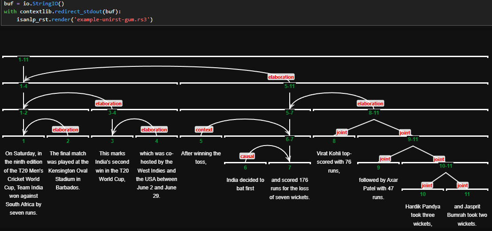

 
[](https://colab.research.google.com/drive/1dFItacO_fiOczrVno-hXEn2HTTN6ldH5?usp=sharing)


# IsaNLP RST Parser

This library provides several versions of the Rhetorical Structure (RST) parser for multiple languages. Below, you will find instructions on how to set up and run the parser either locally or using Docker.

### Table of Contents

  * [Performance](#performance)
  * [Installation & Quick Start](#installation--quick-start)
  * [Visualizing the RST Tree](#visualizing-the-rst-tree)
  * [Advanced Usage](#advanced-usage)
  * [Docker Setup](#docker-setup)
  * [Citation](#citation)


## Performance

The parser achieves strong end-to-end performance across various standard RST corpora.

**Supported languages (all):** English (eng), Czech (ces), German (deu), Basque (eus), Persian (fas), French (fra), Dutch (nld), Brazilian Portuguese (por), Russian (rus), Spanish (spa), and Chinese (zho).

<details>
<summary><b>Click to view detailed end-to-end performance metrics</b></summary>

| Tag / Version | Languages | Train Data | Test Data | Seg | S | N | R | Full |
| :--- | :--- | :--- | :--- | :--- | :--- | :--- | :--- | :--- |
| `rstdt` | eng | eng.rst.rstdt | eng.rst.rstdt | 97.8 | 75.6 | 65.0 | 55.6 | 53.9 |
| `gumrrg` | eng, rus | eng.erst.gum, rus.rst.rrg | eng.erst.gum | 95.5 | 67.4 | 56.2 | 49.6 | 48.7 |
| | | | rus.rst.rrg | 97.0 | 67.1 | 54.6 | 46.5 | 45.4 |
| `rstreebank` | rus | rus.rrt | rus.rst.rrt | 92.1 | 66.2 | 53.1 | 46.1 | 46.2 |
| `unirst` | all | all | ces.rst.crdt | 94.5 | 59.1 | 41.2 | 28.6 | 28.0 |
| | | | deu.rst.pcc | 96.5 | 67.3 | 47.4 | 34.1 | 32.1 |
| | | | eng.erst.gum | 95.3 | 67.3 | 55.6 | 48.5 | 47.4 |
| | | | eng.rst.oll | 92.5 | 55.7 | 39.0 | 27.5 | 26.3 |
| | | | eng.rst.rstdt | 98.1 | 76.7 | 65.5 | 55.2 | 53.6 |
| | | | eng.rst.sts | 91.2 | 43.3 | 31.3 | 19.4 | 18.7 |
| | | | eng.rst.umuc | 88.8 | 52.6 | 40.6 | 26.2 | 25.8 |
| | | | eus.rst.ert | 92.5 | 66.0 | 50.3 | 34.9 | 34.7 |
| | | | fas.rst.prstc | 94.7 | 63.0 | 50.2 | 40.8 | 40.7 |
| | | | fra.sdrt.annodis | 91.3 | 58.6 | 48.9 | 30.6 | 30.3 |
| | | | nld.rst.nldt | 98.0 | 61.8 | 49.8 | 36.8 | 35.8 |
| | | | por.rst.cstn | 93.9 | 68.4 | 52.8 | 44.9 | 44.5 |
| | | | rus.rst.rrg | 96.4 | 67.4 | 54.0 | 46.3 | 45.1 |
| | | | rus.rst.rrt | 90.7 | 63.0 | 49.0 | 42.3 | 42.2 |
| | | | spa.rst.rststb | 93.4 | 63.5 | 50.3 | 36.0 | 36.0 |
| | | | spa.rst.sctb | 85.5 | 55.1 | 46.8 | 39.1 | 39.1 |
| | | | zho.rst.gcdt | 93.0 | 64.5 | 50.7 | 45.9 | 44.6 |
| | | | zho.rst.sctb | 95.4 | 67.5 | 51.5 | 39.9 | 39.9 |

</details>

## Installation & Quick Start

This guide covers the most common use case: running the parser locally.

### 1\. Installation

Install `isanlp` from GitHub and `isanlp_rst` from PyPI:

```bash
pip uninstall isanlp -y && pip install git+https://github.com/iinemo/isanlp.git
pip install isanlp_rst
```

### 2\. Basic Usage

The following example initializes and runs the parser.

```python
from isanlp_rst.parser import Parser

# Define the version of the model you want to use
version = 'gumrrg'  # Choose from {'gumrrg', 'rstdt', 'rstreebank'}

# Initialize the parser
parser = Parser(hf_model_name='tchewik/isanlp_rst_v3', 
                hf_model_version=version, 
                cuda_device=0) # Use -1 for CPU

text = """
On Saturday, in the ninth edition of the T20 Men's Cricket World Cup, Team India won against South Africa by seven runs. 
The final match was played at the Kensington Oval Stadium in Barbados. This marks India's second win in the T20 World Cup, 
which was co-hosted by the West Indies and the USA between June 2 and June 29.

After winning the toss, India decided to bat first and scored 176 runs for the loss of seven wickets. 
Virat Kohli top-scored with 76 runs, followed by Axar Patel with 47 runs. Hardik Pandya took three wickets, 
and Jasprit Bumrah took two wickets.
"""

# Parse the text to obtain the RST tree
res = parser(text) # res['rst'] contains the binary discourse tree

# Inspect the structure of the root node
print(vars(res['rst'][0]))
```

To use the multilingual UniRST model, you can specify the required relation inventory with `relinventory='lang.code.dataset'`, as listed in the [UniRST performance table](https://github.com/tchewik/isanlp_rst/blob/master/UniRST_Metrics.md). The default inventory for UniRST is `eng.rst.rstdt`. 
   
   ```python
   parser = Parser(hf_model_name='tchewik/isanlp_rst_v3',
                   hf_model_version='unirst',
                   cuda_device=0,
                   relinventory='eng.erst.gum')
   ```
   

### 3\. Understanding the Output

The parser returns an RST tree with a recursive structure. Each node (Discourse Unit) contains:

```python
{
 'id': 21,
 'left': (id=14, start=1, end=323),  # Left child node
 'right': (id=20, start=324, end=570), # Right child node
 'relation': 'elaboration',           # Rhetorical relation
 'nuclearity': 'NS',                 # Nucleus-Satellite status
 'entropy': 0.92,                    # Entropy of the split
 'start': 1,                         # Start character offset
 'end': 570,                         # End character offset
 'text': "On Saturday, ... took two wickets."
}
```

-----

## Visualizing the RST Tree

You can easily visualize the output in several ways.

### 1\. Save to RS3 Format

First, export the parsed tree to the standard `.rs3` format.

```python
res['rst'][0].to_rs3('filename.rs3')
```

You can open `filename.rs3` in external tools like **RSTTool** or **rstWeb** for editing.

### 2\. View in Jupyter / Colab

Render the tree directly in your notebook.

```python
import io, contextlib
import isanlp_rst

# Suppress the HTML string from being printed
buf = io.StringIO()
with contextlib.redirect_stdout(buf):
    isanlp_rst.render("filename.rs3")

# If you’re in Google Colab, use colab=True to sync the cell height
# isanlp_rst.render("filename.rs3", colab=True)
```



### 3\. Export to PNG or PDF

To export the visualization, you'll first need to install Playwright:

```bash
pip install playwright
playwright install chromium
```

Then, you can export the `.rs3` file:

```python
import isanlp_rst

# Export to PNG
isanlp_rst.to_png("filename.rs3", "filename.png")

# Export to PDF
isanlp_rst.to_pdf("filename.rs3", "filename.pdf")
```


-----

## Advanced Usage

### Parsing Pre-Segmented EDUs

You can pass custom segments instead of raw text:

```python
my_edus = [
    "On Saturday, Team India won against South Africa.",
    "The final match was played in Barbados."
]

res = parser.from_edus(my_edus)
```

### Memory Management for Large Datasets

When parsing many documents, the resulting `DiscourseUnit` trees can consume significant memory, as each node stores its corresponding text span.

You can use `res['rst'][0].clear_textfields()` to recursively remove all text from the tree, leaving only the structure (IDs, relations, and character offsets). This makes the tree object lightweight for storage (e.g., pickling).

Later, you can use `.fill_textfields(full_text)` to repopulate the tree using the original text.

**Important:** Do not use the `.to_rs3()` method on a tree with cleared text fields. 

-----

## Docker Setup

You can run the parser as a service using Docker. This is currently available for tags: `rstdt`, `gumrrg`, `rstreebank`.

1.  **Run the Docker container:**

    ```bash
    # Pull and run the 'rstreebank' model on port 3335
    docker run --rm -p 3335:3333 --name rst_rrt tchewik/isanlp_rst:3.0-rstreebank
    ```

2.  **Connect with the `isanlp` client:**
    (Note: `isanlp_rst` is not required for the client)

    ```bash
    pip install git+https://github.com/iinemo/isanlp.git
    ```

    ```python
    from isanlp import PipelineCommon
    from isanlp.processor_remote import ProcessorRemote

    # Connect to the running container
    address_rst = ('127.0.0.1', 3335)

    ppl = PipelineCommon([
        (ProcessorRemote(address_rst[0], address_rst[1], 'default'),
         ['text'],
         {'rst': 'rst'})
    ])

    res = ppl(text)
    # res['rst'] will contain the binary discourse tree
    ```

-----
   
## Citation

If you use the IsaNLP RST Parser in your research, please cite our work:

* For `rstdt`, `gumrrg`, and `rstreebank` models:

  ```bibtex
  @inproceedings{chistova-2024-bilingual,
   title = "Bilingual Rhetorical Structure Parsing with Large Parallel Annotations",
   author = "Chistova, Elena",
   booktitle = "Findings of the Association for Computational Linguistics ACL 2024",
   month = aug,
   year = "2024",
   address = "Bangkok, Thailand and virtual meeting",
   publisher = "Association for Computational Linguistics",
   url = "https://aclanthology.org/2024.findings-acl.577",
   pages = "9689--9706"
  }

* For the `unirst` model:
  ```bibtex
  @inproceedings{chistova-2025-bridging,
    title = "Bridging Discourse Treebanks with a Unified Rhetorical Structure Parser",
    author = "Chistova, Elena",
    booktitle = "Proceedings of the 6th Workshop on Computational Approaches to Discourse, Context and Document-Level Inferences (CODI 2025)",
    month = nov,
    year = "2025",
    address = "Suzhou, China",
    publisher = "Association for Computational Linguistics",
    url = "https://aclanthology.org/2025.codi-1.17/",
    pages = "197--208"
   }
  ```
