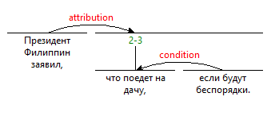

# IsaNLP RST Parser
This Python 3 library provides RST parser for Russian based on neural network models trained on [RuRSTreebank](https://rstreebank.ru/) Russian discourse corpus. The parser should be used in conjunction with [IsaNLP library](https://github.com/IINemo/isanlp) and can be considered its module.  

## Installation

1. Install IsaNLP and its dependencies:
```
pip install grpcio
pip install git+https://github.com/IINemo/isanlp.git@discourse
```  

2. Deploy docker containers for syntax and discourse parsing:  
```
docker run --rm -p 3334:3333 inemo/isanlp_udpipe
docker run --rm -p 3335:3333 tchewik/isanlp_rst
```  
2. Connect from python using `PipelineDefault`:  
```python  
#
from isanlp_srl_framebank.pipeline_default import PipelineDefault  
#
ppl = PipelineCommon([
    (ProcessorRemote('localhost', 3334, '0'),
     ['text'],
     {'sentences': 'sentences',
      'tokens': 'tokens',
      'lemma': 'lemma',
      'syntax_dep_tree': 'syntax_dep_tree',
      'postag': 'ud_postag'}),
    (ProcessorMystem(delay_init=False),
     ['tokens', 'sentences'],
     {'postag': 'postag'}),
    (ConverterMystemToUd(),
     ['postag'],
     {'morph': 'morph',
      'postag': 'postag'}),
    (ProcessorRemote('localhost', 3335, 'default'),
     ['text', 'tokens', 'sentences', 'postag', 'morph', 'lemma', 'syntax_dep_tree'],
     {'rst': 'rst'})
])
res = ppl("Президент Филиппин заявил, что поедет на дачу, если будут беспорядки.")
#
```   
4. The `res` variable should contain all annotations including RST annotations stored in `res['srl']`:
```
{'text': 'Президент Филиппин заявил, что поедет на дачу, если будут беспорядки.',
 'sentences': [<isanlp.annotation.Sentence at 0x7fc9dde12990>],
 'tokens': [<isanlp.annotation.Token at 0x7fc9dde12950>,
  <isanlp.annotation.Token at 0x7fc9dde12110>,
  <isanlp.annotation.Token at 0x7fc9dde12490>,
  <isanlp.annotation.Token at 0x7fc9dde12290>,
  <isanlp.annotation.Token at 0x7fc9dde12550>,
  <isanlp.annotation.Token at 0x7fc9dde12e10>,
  <isanlp.annotation.Token at 0x7fc9dde12d50>,
  <isanlp.annotation.Token at 0x7fc9dde12690>,
  <isanlp.annotation.Token at 0x7fc9dde12c10>,
  <isanlp.annotation.Token at 0x7fc9dde128d0>,
  <isanlp.annotation.Token at 0x7fc9dde12a50>,
  <isanlp.annotation.Token at 0x7fc9dde12bd0>,
  <isanlp.annotation.Token at 0x7fc9dde12a10>],
 'lemma': [['президент',
   'филиппин',
   'заявить',
   ',',
   'что',
   'поедет',
   'на',
   'дачу',
   ',',
   'если',
   'быть',
   'беспорядок',
   '.']],
 'syntax_dep_tree': [[<isanlp.annotation.WordSynt at 0x7fc9dddb7b10>,
   <isanlp.annotation.WordSynt at 0x7fc9dddb72d0>,
   <isanlp.annotation.WordSynt at 0x7fc9dddb7ed0>,
   <isanlp.annotation.WordSynt at 0x7fc9dddb78d0>,
   <isanlp.annotation.WordSynt at 0x7fc9dddb7d10>,
   <isanlp.annotation.WordSynt at 0x7fc9dddb7710>,
   <isanlp.annotation.WordSynt at 0x7fc9dddb7610>,
   <isanlp.annotation.WordSynt at 0x7fc9dddb7d50>,
   <isanlp.annotation.WordSynt at 0x7fc9dddb7a50>,
   <isanlp.annotation.WordSynt at 0x7fc9dddb7a10>,
   <isanlp.annotation.WordSynt at 0x7fc9dddb7950>,
   <isanlp.annotation.WordSynt at 0x7fc9dde12b50>,
   <isanlp.annotation.WordSynt at 0x7fc9dde12450>]],
 'ud_postag': [['NOUN',
   'PROPN',
   'VERB',
   'PUNCT',
   'SCONJ',
   'NOUN',
   'ADP',
   'NOUN',
   'PUNCT',
   'SCONJ',
   'AUX',
   'NOUN',
   'PUNCT']],
 'postag': [['NOUN',
   'NOUN',
   'VERB',
   '',
   'CONJ',
   'VERB',
   'ADP',
   'NOUN',
   '',
   'CONJ',
   'VERB',
   'NOUN',
   '']],
 'morph': [[{'fPOS': 'NOUN',
    'Gender': 'Masc',
    'Animacy': 'Anim',
    'Case': 'Nom',
    'Number': 'Sing'},
   {'fPOS': 'NOUN',
    'Gender': 'Masc',
    'Animacy': 'Anim',
    'Case': 'Nom',
    'Number': 'Sing'},
   {'fPOS': 'VERB',
    'Valency': 'TR',
    'Tense': 'Past',
    'Number': 'Sing',
    'VerbForm': 'Fin',
    'Gender': 'Masc',
    'Aspect': 'Perf'},
   {},
   {'fPOS': 'CONJ'},
   {'fPOS': 'VERB',
    'Aspect': 'Perf',
    'Valency': 'INTR',
    'Tense': 'Imp',
    'Number': 'Sing',
    'VerbForm': 'Fin',
    'Person': '3'},
   {'fPOS': 'ADP'},
   {'fPOS': 'NOUN',
    'Gender': 'Fem',
    'Animacy': 'Inan',
    'Case': 'Acc',
    'Number': 'Sing'},
   {},
   {'fPOS': 'CONJ'},
   {'fPOS': 'VERB',
    'Valency': 'INTR',
    'Tense': 'Imp',
    'Number': 'Plur',
    'VerbForm': 'Fin',
    'Person': '3'},
   {'fPOS': 'NOUN',
    'Gender': 'Masc',
    'Animacy': 'Inan',
    'Case': 'Acc',
    'Number': 'Plur'},
   {}]],
 'rst': [<isanlp.annotation_rst.DiscourseUnit at 0x7fc9dddcbd90>]}
```  
5. The variable `res['rst']` can be visualized as:  


## Package overview  
1. The discourse parser. Is implemented in `ProcessorRST` class. Path: `src/isanlp_srl_framebank/processor_rst.py`.
2. Trained neural network models for RST parser: models for segmentation, structure predictor, and label predictor. Path: `models`.
3. Docker container [tchewik/isanlp_rst](https://hub.docker.com/r/tchewik/isanlp_rst/) that contains preinstalled libraries and models. The container provides gRPC service for RST parsing. The container can be obtained with the command:  
`docker run --rm -p 3335:3333 tchewik/isanlp_rst`

## Usage 

The usage example is available in `examples/usage.ipynb`.

### RST data structures
The results of RST parser are stored in a list of `isanlp.annotation_rst.DiscourseUnit` objects. Each object represents a tree for a paragraph or multiple paragraphs of a text.
DiscourseUnit objects have the following members:
  * id(int): id of a discourse unit.
  * start(int): starting position (in characters) of a current discourse unit span in original text.
  * end(int): ending position (in characters) of a current discourse unit span in original text.
  * relation(string): 'elementary' if the current unit is a discourse tree leaf, or RST relation.
  * nuclearity(string): nuclearity orientation for current unit. `_` for elementary discourse units or one of `NS`, `SN`, `NN` for non-elementary units.
  * left(DiscourseUnit or None): left child node of a non-elementary unit.
  * right(DiscourseUnit or None): right child node of a non-elementary unit.
  * proba(float): probability of the node presence obtained from structure classifier.

It is possible to operate with DiscourseUnits objects as binary structures. For example, to extract relations pairs from the tree like this:
```python
def extr_pairs(tree, text):
    pp = []
    if tree.left:
        pp.append([text[tree.left.start:tree.left.end],
                   text[tree.right.start:tree.right.end], 
                   tree.relation, tree.nuclearity])
        pp += extr_pairs(tree.left, text)
        pp += extr_pairs(tree.right, text)
    return pp
    
print(extr_pairs(res['rst'][0], res['text']))
```  

The result for `'Президент Филиппин заявил, что поедет на дачу, если будут беспорядки.'`:
```
[['Президент Филиппин заявил,', 'что поедет на дачу, если будут беспорядки.', 'attribution', 'SN'], 
 ['что поедет на дачу,', 'если будут беспорядки.', 'condition', 'NS']]
```  
